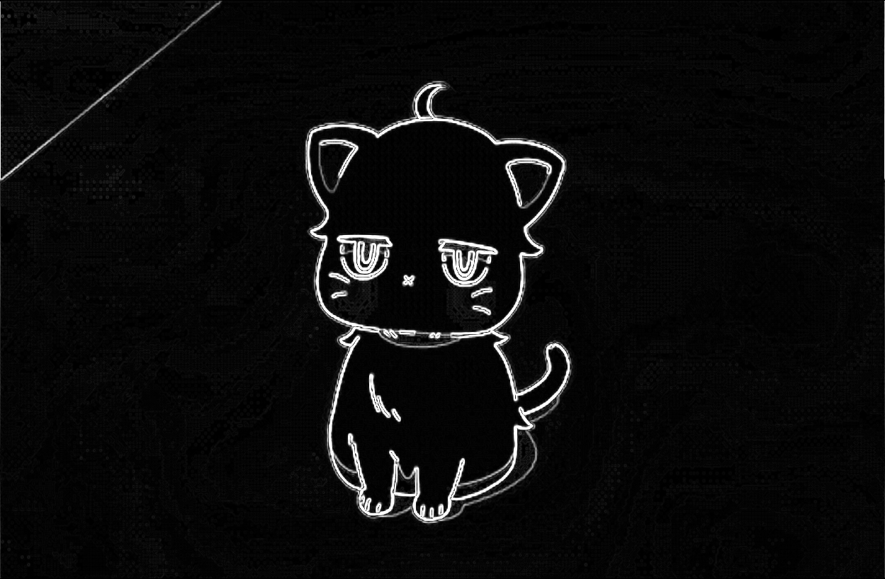

# Mockup Canvas in Vanilla JS

This project provides an exercise on Canvas features using Vanilla JavaScript. The goal is to enable users to modify an image by applying various filters and transformations directly within the browser.

## Preview

## Features

- **Modify My Image**
  - User-friendly interface to load an image from the user's device.

- **Select an Image**
  - Ability to choose an image using the selection button or by drag-and-drop.

- **Custom Filters**
  - Multiple pre-defined filter options to alter the image's appearance.
  - Horizontal and vertical rotation options.
  - Image cropping in width and height.
  - Adjustable brightness, contrast, saturation, and color inversion with interactive sliders.
  - Option to add a custom quote to the image.

- **Export**
  - Export button to save the modified image.

## How to Use

1. Open the `index.html` file in your browser.
2. Load an image using the selection button or by drag-and-drop.
3. Apply filters and adjust settings according to your preferences.
4. Click the "Export" button to save the modified image.

## Project Structure

- **CSS**
  - `styles.css`: Style file for the interface layout.

- **JS (JavaScript)**
  - `dropImage.js`: Image loading management.
  - `filter.js`: Implementation of basic filters.
  - `filterSobel.js`: Sobel filtering for contours.
  - `canvasFilter.js`: Functions to apply filters on the canvas.
  - `recadrerRotation.js`: Functions for cropping and rotating the image.
  - `textCanvas.js`: Handling the addition of text to the image.
  - `codeFilter.js`: Logic for custom filters.
